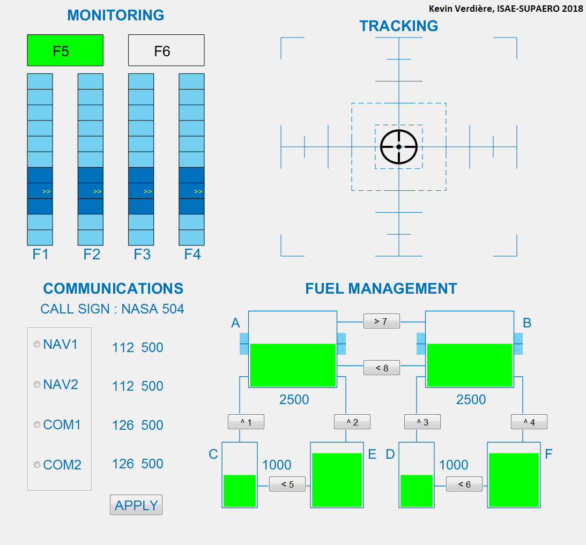

# MATB

Matlab modifed version of the NASA MATBII  
Multi Attribute Task Battery (Replica from the NASA version - https://matb.larc.nasa.gov/)  

Author: Kevin Verdière, ISAE-SUPAERO, 2018,  
kevin@verdiere.fr / kevin.verdiere@isae-supaero.fr   

if you are doing research and publishing, pleace cite :  
"Spectral EEG-based classification for operator dyads’ workload and cooperation level estimation" 
Kevin J. Verdière, Frédéric Dehais, and Raphaëlle Roy  
IEEE SMC 'Systems, Man and Cybernetics' 2019, Bari  

@inproceedings{verdiere2019spectral,  
  title={Spectral EEG-based classification for operator dyads’ workload and cooperation level estimation},  
  author={Verdi{\`e}re, Kevin J and Dehais, Fr{\'e}d{\'e}ric and Roy, Rapha{\"e}lle N},  
  booktitle={2019 IEEE International Conference on Systems, Man and Cybernetics (SMC)},  
  pages={3919--3924},  
  year={2019},  
  organization={IEEE}  
} 

